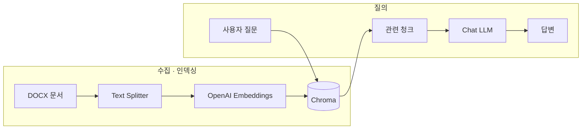

<div align="center">

# LLM · RAG 실습 노트

**LangChain**과 **Chroma**로 문서 기반 질의응답을 실험하는 개인 연구·강의용 저장소입니다.

[](https://www.python.org/downloads/)
[](https://github.com/langchain-ai/langchain)
[](https://www.trychroma.com/)
[](https://platform.openai.com/)

_문서 로드 → 청크 분할 → 임베딩 → 벡터 저장 → 검색 → 답변_

</div>

---

## 목차

- [개요](#개요)
- [아키텍처](#아키텍처)
- [기술 스택](#기술-스택)
- [시작하기](#시작하기)
- [노트북 가이드](#노트북-가이드)
- [환경 변수](#환경-변수)
- [프로젝트 구조](#프로젝트-구조)
- [주의사항](#주의사항)
- [GitHub에서 레포 꾸미기](#github에서-레포-꾸미기)

---

## 개요

이 레포지토리는 **RAG(Retrieval-Augmented Generation)** 파이프라인을 노트북 단계로 나누어 따라가며 구현합니다.

1. **`.docx`** 문서를 읽고
2. **Recursive Character Text Splitter**로 청크를 나누며
3. **OpenAI 임베딩**으로 벡터화한 뒤 **Chroma**에 저장하고
4. 유사도 검색으로 관련 문맥을 가져와 **LLM**에 전달합니다.

---

## 아키텍처



---

## 기술 스택

| 구분           | 사용                                     |
| -------------- | ---------------------------------------- |
| 언어           | Python 3.10+                             |
| 오케스트레이션 | LangChain, LangGraph                     |
| LLM / 임베딩   | OpenAI (`langchain-openai`)              |
| 벡터 DB        | Chroma (`langchain-chroma`)              |
| 문서 로더      | `Docx2txtLoader` (`langchain-community`) |
| 설정           | `python-dotenv`                          |

> **LangChain v1:** `hub` 등 일부 API는 `langchain-classic` 네임스페이스를 사용합니다. 노트북 주석·import를 환경에 맞게 조정하세요.

---

## 시작하기

### 1. 저장소 클론

```bash
git clone https://github.com/<your-username>/llm-rag-application.git
cd llm-rag-application
```

### 2. 가상환경 (Windows 예시)

```powershell
py -3.10 -m venv .venv
.\.venv\Scripts\Activate.ps1
```

### 3. 의존성 설치

노트북 상단의 `%pip install ...` 셀을 실행하거나, 아래처럼 한 번에 설치할 수 있습니다.

```powershell
pip install python-dotenv langchain langchain-classic langchain-openai langchain-community langchain-text-splitters langchain-chroma chromadb docx2txt ipykernel jupyter
```

버전을 고정하려면 이후 `pip freeze > requirements.txt`로 스냅샷을 만드는 것을 권장합니다.

### 4. 환경 변수

프로젝트 루트에 `.env` 파일을 만들고 [환경 변수](#환경-변수)를 채웁니다.

### 5. Jupyter

VS Code / Cursor에서 노트북 커널을 **`.venv`**의 Python으로 선택한 뒤 셀을 실행합니다.

---

## 노트북 가이드

| 파일                         | 내용                                            |
| ---------------------------- | ----------------------------------------------- |
| `1.langchain_llm_test.ipynb` | `load_dotenv`, `ChatOpenAI`로 기본 호출 테스트  |
| `2.rag_with.chroma.ipynb`    | DOCX 로드 → 스플릿 → 임베딩 → Chroma → RAG 체인 |

**권장 순서:** `1` → `2`  
`2`번 노트북은 예시로 `./tax.docx`를 사용합니다. 다른 파일을 쓰려면 로더 경로만 바꾸면 됩니다.

---

## 환경 변수

루트에 `.env`를 두고 다음 키를 설정합니다. (값은 **절대** Git에 올리지 마세요.)

| 변수                | 설명                                           |
| ------------------- | ---------------------------------------------- |
| `OPENAI_API_KEY`    | OpenAI API 호출용                              |
| `LANGCHAIN_API_KEY` | (선택) LangSmith / Hub 프롬프트 pull 등에 사용 |

`.env`는 `.gitignore`에 포함되어 있습니다.

---

## 프로젝트 구조

```
llm-rag-application/
├── 1.langchain_llm_test.ipynb   # LLM 스모크 테스트
├── 2.rag_with.chroma.ipynb      # Chroma 기반 RAG
├── tax.docx                     # 예시 문서 (필요 시 교체)
├── chroma/                      # 로컬 Chroma 저장소 (실행 시 생성·갱신)
├── .env                         # 로컬 전용 (저장소에 포함하지 않음)
├── .gitignore
└── README.md
```

---

## 주의사항

- **API 비용:** 임베딩·채팅 모델 호출에 따라 OpenAI 과금이 발생합니다.
- **`chroma/` 용량:** 인덱싱 후 SQLite 등이 커질 수 있습니다. 공개 레포에는 포함 여부를 신중히 정하세요.
- **노트북 셀 타입:** `%pip` 라인은 **코드 셀**에서 실행해야 합니다 (마크다운 셀이면 실행되지 않습니다).

---

## GitHub에서 레포 꾸미기

웹에서 보기 좋게 만드는 체크리스트입니다.

1. **About 설정**  
   레포 메인 우측 톱니바퀴 → *General*이 아니라 메인 페이지에서 **About** 옆 연필 아이콘 → **Description**에 한 줄 설명, **Website**(선택), **Topics**에 `python`, `langchain`, `rag`, `chromadb`, `openai` 등 태그 추가.

2. **Social preview**  
   _Settings_ → _General_ 하단 **Social preview** → _Edit_ 에서 카드용 이미지 업로드 (1280×640 권장).

3. **기본 브랜치**  
   _Settings_ → _General_ → **Default branch**를 `main` 등으로 통일.

4. **README 표시**  
   루트의 `README.md`가 자동으로 메인에 렌더링됩니다. 위 배지·Mermaid는 GitHub에서 지원됩니다.

5. **보안**  
   _Settings_ → _Code security_ 에서 Dependabot 등 필요 시 켜기. 키가 한 번이라도 커밋되었다면 키 **회전(재발급)** 을 권장합니다.

<details>
<summary>추가로 하면 좋은 것</summary>

- **LICENSE** 파일 추가 (MIT 등)
- **`.env.example`** 에 변수 _이름만_ 적어 두고 실제 값은 비워 두기
- **GitHub Actions**로 `pip install` + import 스모크 테스트

</details>

---

<div align="center">

**Made for learning & experiments**

</div>
